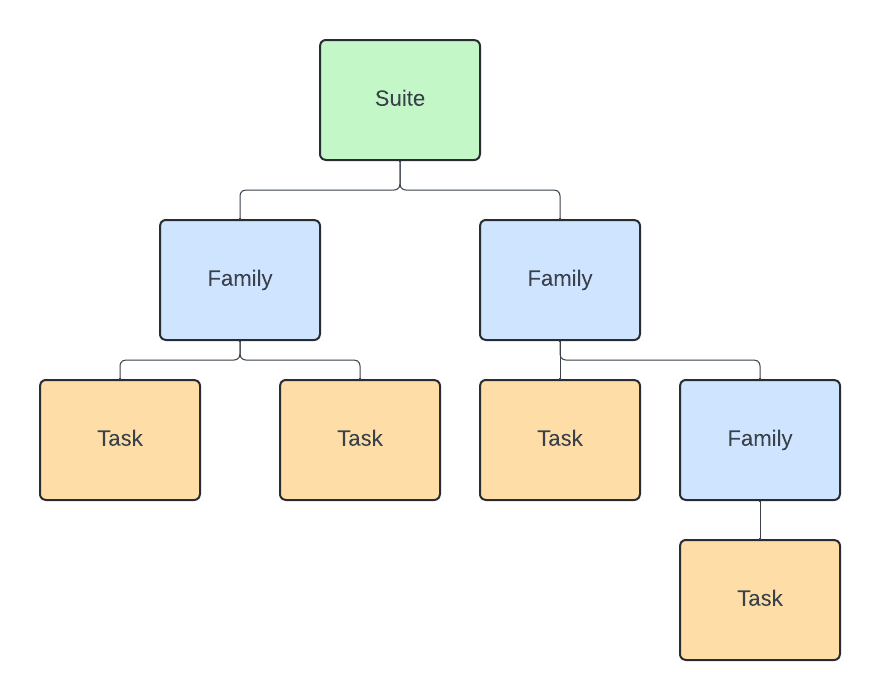

ecFlow
======

In order to understand how to use the ECFLOW RAPID workflow for GEOGLoWS we
first need to understand what ecFlow is and how it works. This page gives a
very basic overview of some ecFlow concepts.

Introduction
------------

**ecFlow** is a workflow management system that is used to manage the
execution of workflows on a distributed computing environment. It is
particularly useful for workflows that require the execution of multiple
tasks in a specific order, and where the output of one task is the input
for another task.

geoglows_ecflow is a python package that provides a way to create a geoglows
forecast workflow definition, submit the workflow to the ecFlow server, and run the workflow
on the ecFlow server.

This section of the documentation will give you a very brief overview of ecFlow so that
you can understand how to use the geoglows_ecflow package.

ecFlow Suite Definitions
---------------------------

An ecFlow suite definition is a set of tasks that are executed in a specific order.
A suite definition is built up of tasks, families, and a suite. Tasks, families, and the suite
can be thought of as a tree like structure where the suite is the root of the tree, families
are the branches, and tasks are the leaves. The image below shows a visual representation of this structure.



Next we'll go over each of these components in more detail. We will take a bottom up approach and start with tasks.

#### Tasks

An ecFlow task is the basic unit of work in an ecFlow workflow.
A task represents a job that needs to be carried out.
A task runs a script defined in a separate script file. Tasks have
names and the script the task runs should be in a .ecf file that shares the same
name as the task. The python code below shows a simple example of how to create a task.
```python
from ecflow import Task

# Create a Task
task = Task("t1")   # Here we create a task with name t1

# Add a variable to the task.
# Variables can be added to tasks to store additional information.
# In our case we are telling the task the location of the home directory,
# which is the directory where the script associated with this task is located.
task.add_variable("ECF_HOME", "/path/to/home")

# Add a trigger to the task
# Triggers are used to define dependencies between tasks.
# Task t1 will only run once task t2 is complete.
task.add_trigger("t2 == complete")
```

### Families


A suite definition will have many tasks, and lots of these tasks will be related to each other.
That is where the Family object comes in. A Family is a collection of tasks that are related to each other.
A family can contain multiple tasks as well as other families. The python code below shows a simple example 
of how to create a family and add tasks to it.

```python

   from ecflow import Task, Family

   # Create a Family
   family = Family("f1")   # Here we create a family with name f1

   # Add a task to the family
   task1 = Task("t1")   # Here we create a task with name t1
   family.add_task(task1)

   # Add another task to the family
   task2 = Task("t2")   # Here we create a task with name t2
   family.add_task(task2)
```
Note

   Tasks within a family are not allowed to share a name.
   Attempting to add a task with a name that already exists within the family will raise an exception.

### Suites

A suite is the root node of a suite definition. Suites are used to group families and tasks that achieve a common function.
A suite can also hold variables and other things, but those aren't covered in this guide. The python code below shows a simple
example of how to create a suite and add families to it.

```python
   from ecflow import Suite, Family

   # Create a Suite
   suite = Suite("s1")   # Here we create a suite with name s1

   # Add a family to the suite
   family = Family("f1")   # Here we create a family with name f1
   family.add_task(Task("t1"))
   suite.add_family(family)

   # Add another family to the suite
   family2 = Family("f2")   # Here we create a family with name f2
   family2.add_task(Task("t2"))
   suite.add_family(family2)
```
The important things to understand for our purposes are that suites contain families, families contain tasks, and tasks run scripts.
The suite definition is used to organize a workflow of related tasks in order to achieve a common goal. Now that we have a basic understanding
of an ecFlow suite definition lets look at how to prepare a suite definition to be run on an ecFlow server.

### Defs

After you have created a suite definition you need to prepare it to be run on an ecFlow server. This is done by creating a Defs object.
A Defs object is a collection of suites that are ready to be run on an ecFlow server. The Defs object has many methods for working with your definition,
including methods to write and read the definition to a .def file.

If we had a suite definition stored in a variable named :code:`suite`, we could create a Defs object from it like this:

```python

   # The import for Defs
   from ecflow import Suite, Family, Task, Defs

   defs = Defs()
   defs.add_suite(suite)
```
We can then write the definition to a .def file like this:

```python

   defs.save_as_defs("path/to/definition.def")
```
The .def file just created is the file that we would submit to the ecFlow server to run the workflow.

### Submitting a Definition to the ecFlow Server

To submit a definition to the ecFlow server we need to use the Client class. 
The Client class is used to communicate with the ecFlow server. 
The python code below shows how to submit a definition to the ecFlow server using a Client object.

```python

   from ecflow import Client

   # Create a Client object
   client = Client("localhost", 2500)

   # Load the definition from the .def file
   client.load("path/to/definition.def")
```
We can then begin the suite on the server like this:

```python

   # Begin the client
   client.begin_suite("s1")
```
The string passed to begin_suite is the name of the suite that you want to run.
The client class has many other methods for working with the server, but we won't cover them here.

### geoglows_ecflow

The geoglows_ecflow package uses the ecFlow python package to create the tasks, families, and suites that make up the GEOGLOWS RAPID forecast job.
It provides an easy way to create a geoglows forecast suite definition, submit the definition to an ecFlow server, and run the definition.
Having some knowledge of the ecFlow concepts covered on this page will help you understand what the geoglows_ecflow package does, and how to use it.
