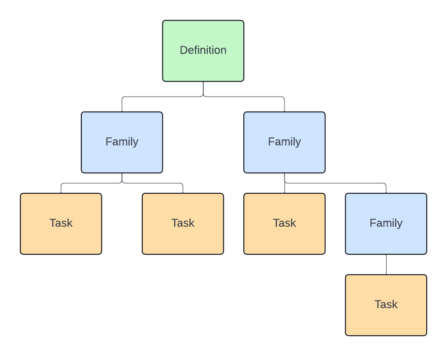

ecFlow
======

In order to understand how to use the ECFLOW RAPID workflow for GEOGloWS we
first need to understand what ecFlow is and how it works.

Introduction
------------

**ecFlow** is a workflow management system that is used to manage the
execution of workflows on a distributed computing environment. It is
particularly useful for workflows that require the execution of multiple
tasks in a specific order, and where the output of one task is the input
for another task.

geoglows_ecflow is a python package that provides a way to create a geoglows
forecast workflow definition, submit the workflow to the ecFlow server, and run the workflow
on the ecFlow server.

This section of the documentation will give you a brief overview of ecFlow so that
you can understand how to use the geoglows_ecflow package.

ecFlow Workflow Definitions
---------------------------

An ecFlow workflow definition is a set of tasks that are executed in a specific order.
A workflow is built up of tasks, families, and a definition. Tasks, families, and the definition
can be thought of as a tree like structure where the definition is the root of the tree, families
are the branches, and tasks are the leaves. The image below shows a visual representation of this structure.

Next we'll go over each of these components in more detail. We will take a bottom up approach and start with tasks.

Tasks
~~~~~

An ecFlow task is the basic unit of work in an ecFlow workflow.
A task runs a script defined in a separate script file. Tasks have
names and the script the task runs should be in a .ecf file that shares the same
name as the task. The python code below shows a simple example of how to create a task.

.. code-block:: python

   from ecflow import Task, Defs, Suite, Edit

   # Create a Task
   task = Task("t1")   # Here we create a task with name t1

   # Add a variable to the task.
   # Variables can be added to tasks to store additional information.
   # In our case we are telling the task to location of the home directory
   # where the script it runs is located.
   task.add_variable("ECF_HOME", "/path/to/home")

   # Add a trigger to the task
   # Triggers are used to define dependencies between tasks.
   # We will look at triggers in more detail in a later section.
   task.add_trigger("t2 == complete")

Families
~~~~~~~~

An ecFlow workflow will have many tasks, and lots of these tasks will be related to each other.
That is where the Family object comes in. A Family is a collection of tasks that are related to each other.
A family can contain multiple tasks as well as other families. The python code below shows a simple example 
of how to create a family and add tasks to it.

.. code-block:: python
   
   from ecflow import Task, Defs, Suite, Edit, Family

   # Create a Family
   family = Family("f1")   # Here we create a family with name f1

   # Add a task to the family
   task1 = Task("t1")   # Here we create a task with name t1
   family.add_task(task1)

   # Add another task to the family
   task2 = Task("t2")   # Here we create a task with name t2
   family.add_task(task2)

It is important to note that tasks within a family are not allowed to share the same name.
If you attempt to add a task to a family with a name that already exists in the family, an exception will be raised.